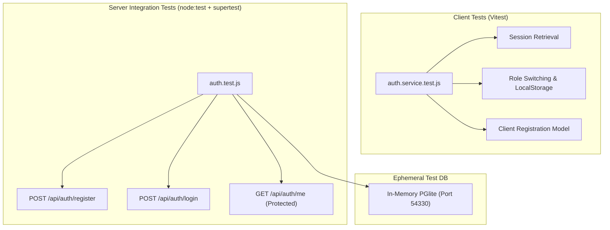

# Test Case Plan: Native MERN Stack Authentication & Registration

## 1. Document Overview

| Attribute | Details |
| :--- | :--- |
| **Project** | Alumni Network Portal (MERN / PERN Architecture) |
| **Frontend Stack** | React 19, Vite 6, Tailwind CSS 4 |
| **Backend Stack** | Node.js 20+, Express 5, PostgreSQL / PGlite |
| **Testing Tooling** | `node:test` + `supertest` (Backend API), `vitest` (Frontend Client) |
| **Coverage Scope** | User Registration (Student & Alumni), Login, Session Tokens, Roles |
| **Target Status** | Implemented & 100% Passed (21/21 Tests) |

---

## 2. Test Architecture

The testing architecture mirrors the dual-tier monorepo structure:



---

## 3. Backend Test Matrix (`server/tests/auth.test.js`)

Executed with `npm run test:auth` or `node --test tests/auth.test.js`.

| Test ID | Method & Route | Scenario / Inputs | Expected Output | Status |
| :--- | :--- | :--- | :--- | :--- |
| **TC-AUTH-01** | `POST /api/auth/register` | Register student with valid fields (`yearOfStudy=3`, terms accepted) | `201 Created`, user profile returned with `role: STUDENT` | **PASS** |
| **TC-AUTH-02** | `POST /api/auth/register` | Register alumni with graduation year (`graduationYear=2021`) | `201 Created`, user profile returned with `role: ALUMNI` | **PASS** |
| **TC-AUTH-03** | `POST /api/auth/register` | Invalid email format (`invalid-email-format`) | `422 Unprocessable Entity`, Zod validation error | **PASS** |
| **TC-AUTH-04** | `POST /api/auth/register` | Password complexity violations (missing upper, lower, number, symbol, <10 chars) | `422 Unprocessable Entity` for each weak password pattern | **PASS** |
| **TC-AUTH-05** | `POST /api/auth/register` | Terms not accepted (`acceptTerms: false`) | `422 Unprocessable Entity` ("You must accept the terms") | **PASS** |
| **TC-AUTH-06** | `POST /api/auth/register` | Duplicate email registration | `409 Conflict` ("already exists") | **PASS** |
| **TC-AUTH-07** | `POST /api/auth/register` | Alumni registration omitting `graduationYear` | `422 Unprocessable Entity` ("Graduation year is required") | **PASS** |
| **TC-AUTH-08** | `POST /api/auth/register` | Alumni registration providing student `yearOfStudy` | `422 Unprocessable Entity` ("applies to student accounts only") | **PASS** |
| **TC-AUTH-09** | `POST /api/auth/register` | Student registration with `yearOfStudy` out of range (`0`, `7`, `10`, `-1`) | `422 Unprocessable Entity` | **PASS** |
| **TC-AUTH-10** | `POST /api/auth/login` | Valid credentials for registered student | `200 OK`, `accessToken`, `Set-Cookie` with `refresh_token` | **PASS** |
| **TC-AUTH-11** | `POST /api/auth/login` | Non-existent / unregistered email | `401 Unauthorized` ("Invalid email or password") | **PASS** |
| **TC-AUTH-12** | `POST /api/auth/login` | Wrong password for existing user | `401 Unauthorized` ("Invalid email or password") | **PASS** |
| **TC-AUTH-13** | `POST /api/auth/login` | Login on suspended account (`is_suspended=TRUE`) | `403 Forbidden` ("account has been suspended") | **PASS** |
| **TC-AUTH-14** | `GET /api/auth/me` | Valid `Authorization: Bearer <token>` | `200 OK`, caller's authenticated profile returned | **PASS** |
| **TC-AUTH-15** | `GET /api/auth/me` | Missing authentication token | `401 Unauthorized` | **PASS** |

---

## 4. Frontend Test Matrix (`client/src/services/auth.service.test.js`)

Executed with `npm test` inside `client/` (via `vitest`).

| Test ID | Scope | Scenario / Actions | Expected Outcome | Status |
| :--- | :--- | :--- | :--- | :--- |
| **TC-CLIENT-01** | Session Management | `getSession()` when no active user is saved in storage | Returns default Student persona and sets active user ID | **PASS** |
| **TC-CLIENT-02** | Authentication | `login(credentials)` with valid persona | Stores active user in storage and returns `accessToken` | **PASS** |
| **TC-CLIENT-03** | Registration | `register(studentPayload)` | Creates new member, marks `verified=true`, establishes session | **PASS** |
| **TC-CLIENT-04** | Role Integrity | `register(alumniPayload)` | Creates alumni with `verified=false` until admin review | **PASS** |
| **TC-CLIENT-05** | Logout | `logout()` | Clears `alumni_active_user_id` from `localStorage` | **PASS** |
| **TC-CLIENT-06** | Persona Switcher | `switchDemoUser(ROLES.ALUMNI)` | Switches active context to Alumni persona | **PASS** |

---

## 5. Execution Instructions

### Run Backend Tests (Node.js + Supertest):
```powershell
cd server
npm run test:auth
```

### Run Frontend Tests (Vite + Vitest):
```powershell
cd client
npm test
```
